# HGE Notifier - System Architecture

This document provides a comprehensive overview of the HGE Notifier system architecture, including data flow, component interactions, and module dependencies.

## Table of Contents

1. [System Overview](#system-overview)
2. [Data Flow](#data-flow)
3. [Component Architecture](#component-architecture)
4. [Module Dependencies](#module-dependencies)
5. [User Interface Architecture](#user-interface-architecture)
6. [Real-Time Communication](#real-time-communication)
7. [Notification Pipeline](#notification-pipeline)
8. [Deployment Model](#deployment-model)

---

## System Overview

The HGE Notifier is a Python application that monitors Elite Dangerous EDDN for High Grade Emission (HGE) signals and displays their distance from the player's current location.

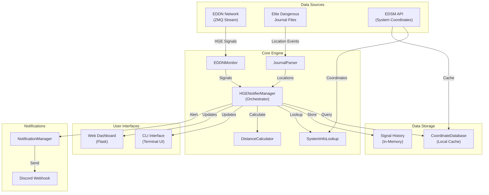

---

## Data Flow

### Signal Processing Pipeline

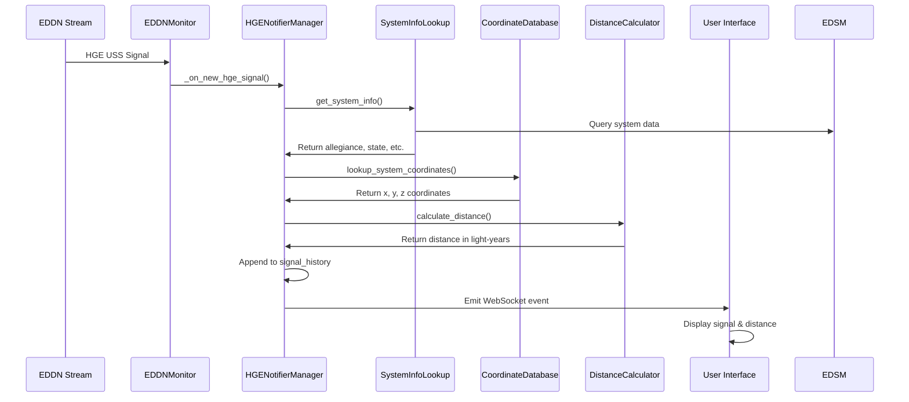

### Location Update Pipeline

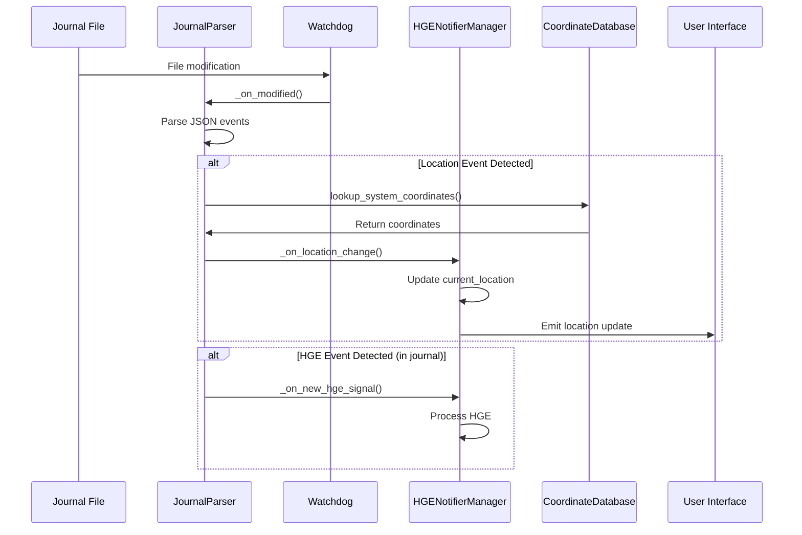

---

## Component Architecture

### Core Components

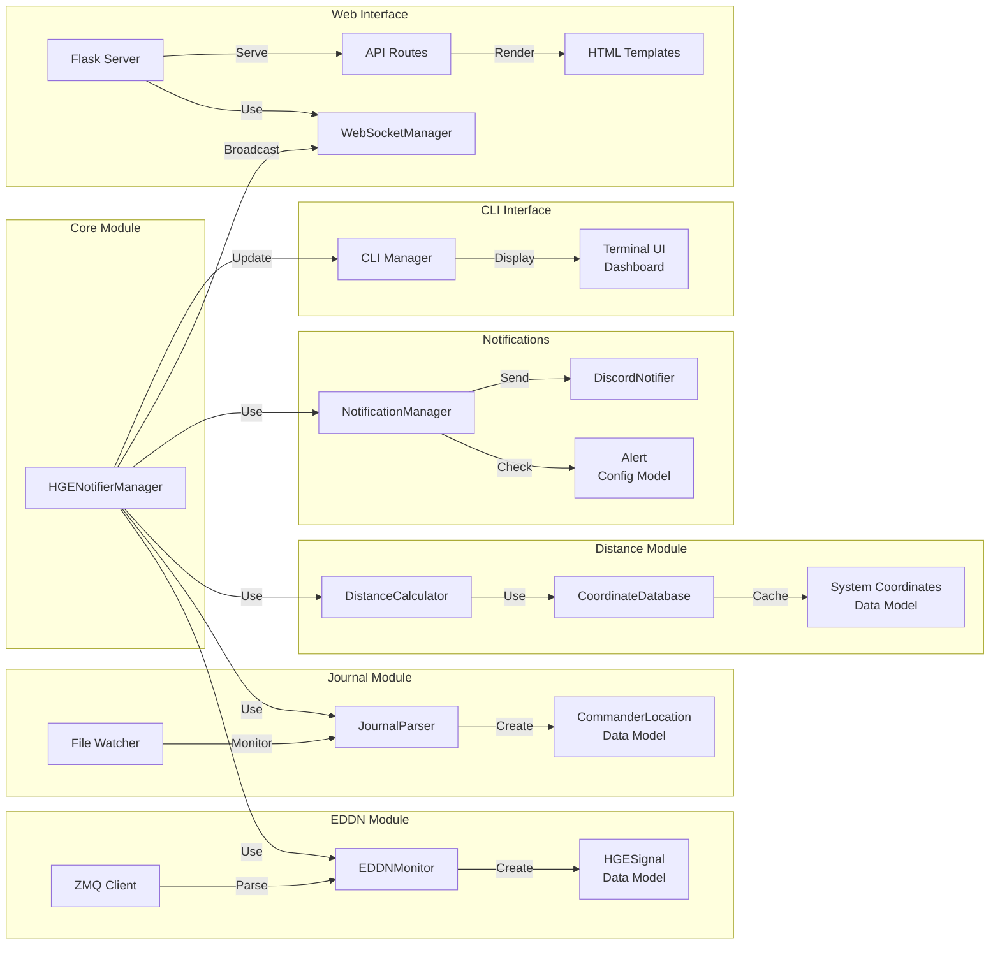

---

## Module Dependencies

### Import Dependencies

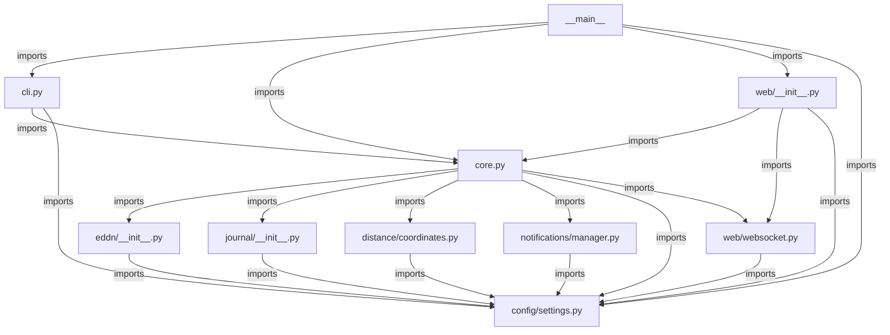

### External Dependencies

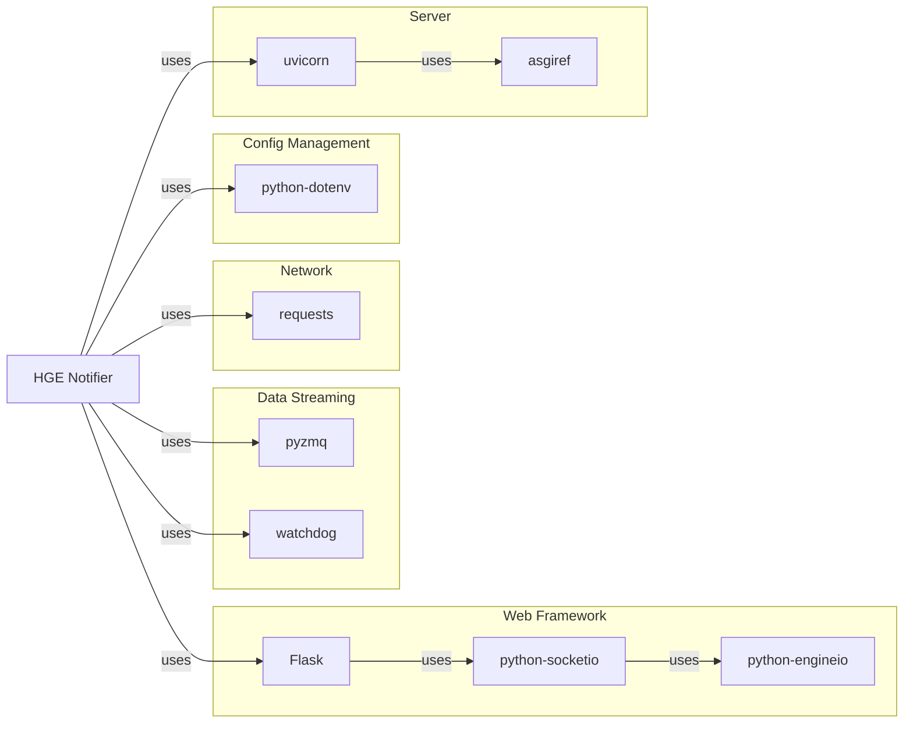

---

## User Interface Architecture

### Web Dashboard Architecture

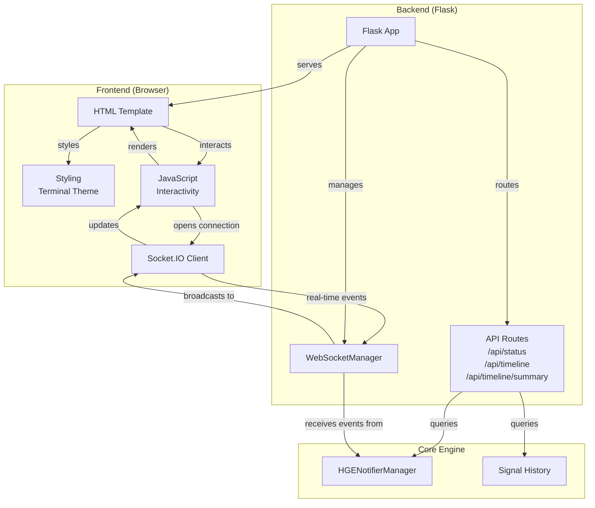

### Dashboard Views

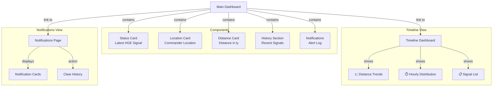

---

## Real-Time Communication

### WebSocket Event Flow

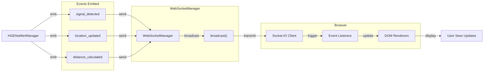

### Connection States

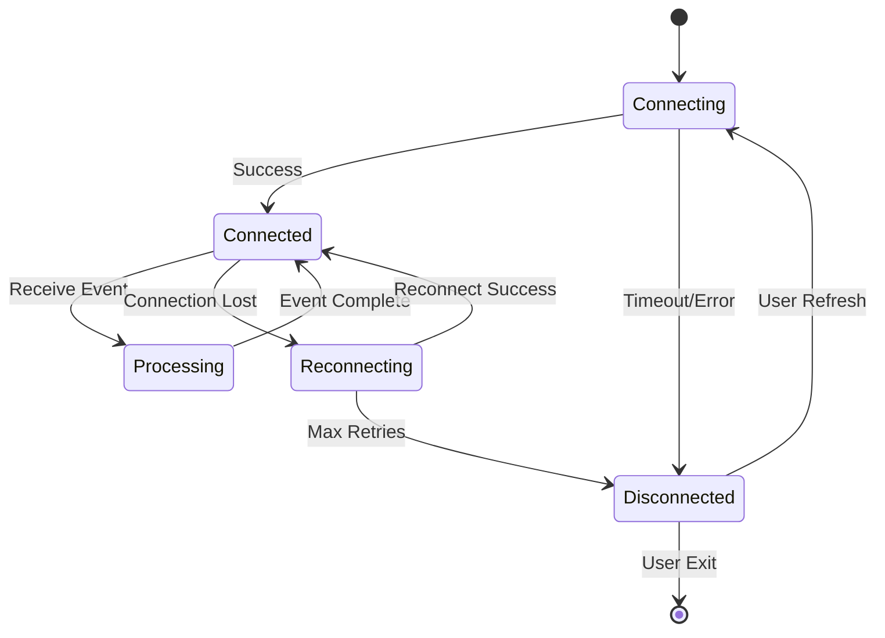

---

## Notification Pipeline

### Alert Processing Flow

```mermaid
graph TB
    Signal["New HGE Signal"]
    
    Signal -->|trigger| Check1{"Distance<br/>within<br/>threshold?"}
    Check1 -->|no| Ignore["Ignore Signal"]
    Check1 -->|yes| Check2
    
    Check2{"Signal Age<br/>within<br/>threshold?"}
    Check2 -->|no| Ignore
    Check2 -->|yes| Check3
    
    Check3{"Cooldown<br/>period<br/>elapsed?"}
    Check3 -->|no| Queue["Queue for Later"]
    Check3 -->|yes| Check4
    
    Check4{"Notifications<br/>enabled?"}
    Check4 -->|no| Log["Log Only"]
    Check4 -->|yes| Send
    
    Send["Send Discord Notification"]
    Queue -->|after delay| Check3
    
    Send --> Update["Update Last Alert Time"]
    Update --> Store["Store in History"]
    Log --> Store
    Store --> [*]
```

### Discord Webhook Integration

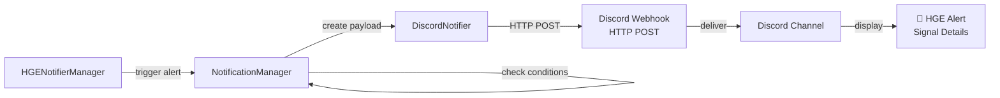

---

## Deployment Model

### Single-User Desktop Deployment

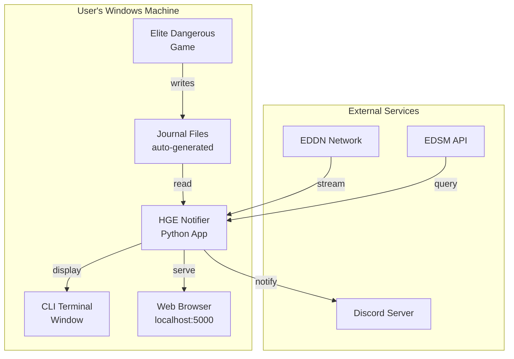

### Execution Flow

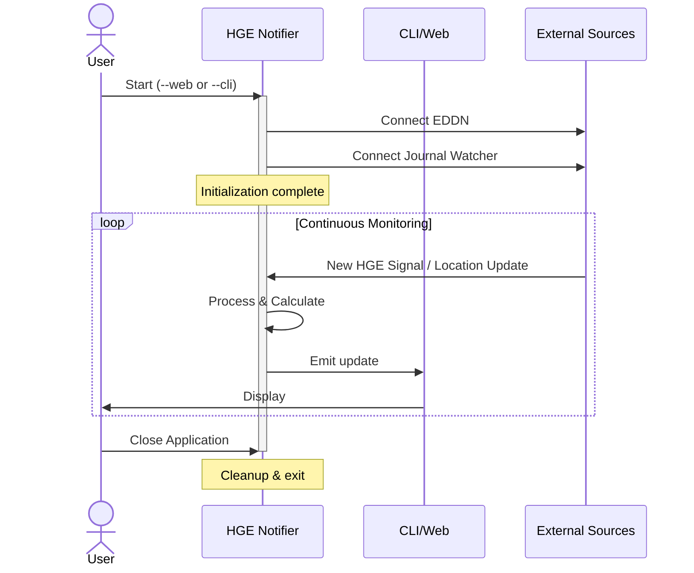

---

## Configuration

### Settings Hierarchy

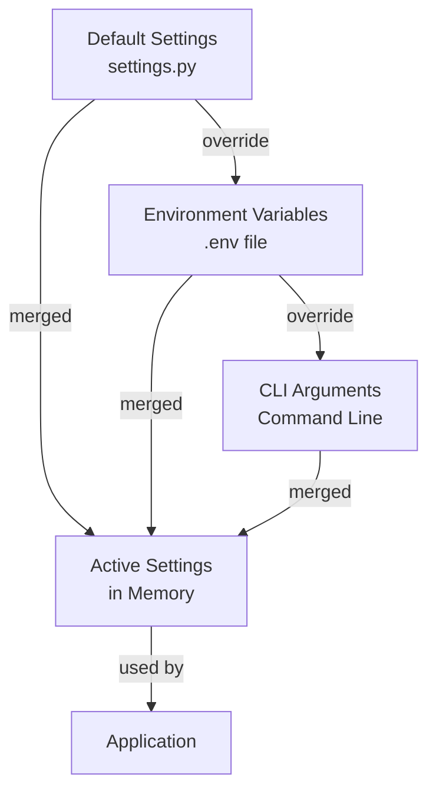

### Key Configuration Areas

```mermaid
graph TB
    Settings["Settings"]
    
    subgraph "EDDN Configuration"
        EDDN_Mock["EDDN_MOCK_MODE"]
        EDDN_URL["EDDN_URL"]
    end
    
    subgraph "Journal Configuration"
        Journal_Path["JOURNAL_PATH"]
    end
    
    subgraph "Notification Configuration"
        Notif_Enabled["NOTIFICATIONS_ENABLED"]
        Discord_URL["DISCORD_WEBHOOK_URL"]
        Alert_Dist["ALERT_MAX_DISTANCE"]
        Alert_Age["ALERT_MAX_AGE"]
        Cooldown["NOTIFICATION_COOLDOWN_SECONDS"]
    end
    
    subgraph "Web Configuration"
        Web_Debug["WEB_DEBUG"]
        Web_Port["WEB_PORT"]
    end
    
    subgraph "Logging"
        Log_Level["LOG_LEVEL"]
        Log_File["LOG_FILE"]
    end
    
    Settings -->|contains| EDDN_Mock
    Settings -->|contains| Journal_Path
    Settings -->|contains| Notif_Enabled
    Settings -->|contains| Web_Debug
    Settings -->|contains| Log_Level
```

---

## Testing Architecture

### Test Organization

```mermaid
graph TB
    Tests["tests/"]
    
    subgraph "Unit Tests"
        ConfigTest["config/test_config.py"]
        EDDNTest["eddn/test_eddn.py"]
        JournalTest["journal/test_journal.py"]
        DistanceTest["distance/test_distance.py"]
        NotifTest["notifications/test_notifications_*.py"]
    end
    
    subgraph "Integration Tests"
        CoreTest["core/test_core.py"]
        CoreManager["core/test_core_manager.py"]
        WebTest["web/test_web*.py"]
        E2ETest["core/test_main.py"]
    end
    
    subgraph "Advanced Tests"
        EdgeCases["core/test_core_edge_cases.py"]
        Formatting["core/test_core_formatting.py"]
        Enrichment["core/test_core_enrichment.py"]
        Websocket["core/test_core_websocket.py"]
    end
    
    Tests --> Unit["Unit Tests<br/>100% coverage"]
    Tests --> Integration["Integration Tests<br/>~80% coverage"]
    Tests --> Advanced["Advanced Tests<br/>Edge cases"]
    
    Unit -->|verify| ConfigTest
    Unit -->|verify| EDDNTest
    Integration -->|verify| CoreTest
    Advanced -->|verify| EdgeCases
```

### Coverage Report

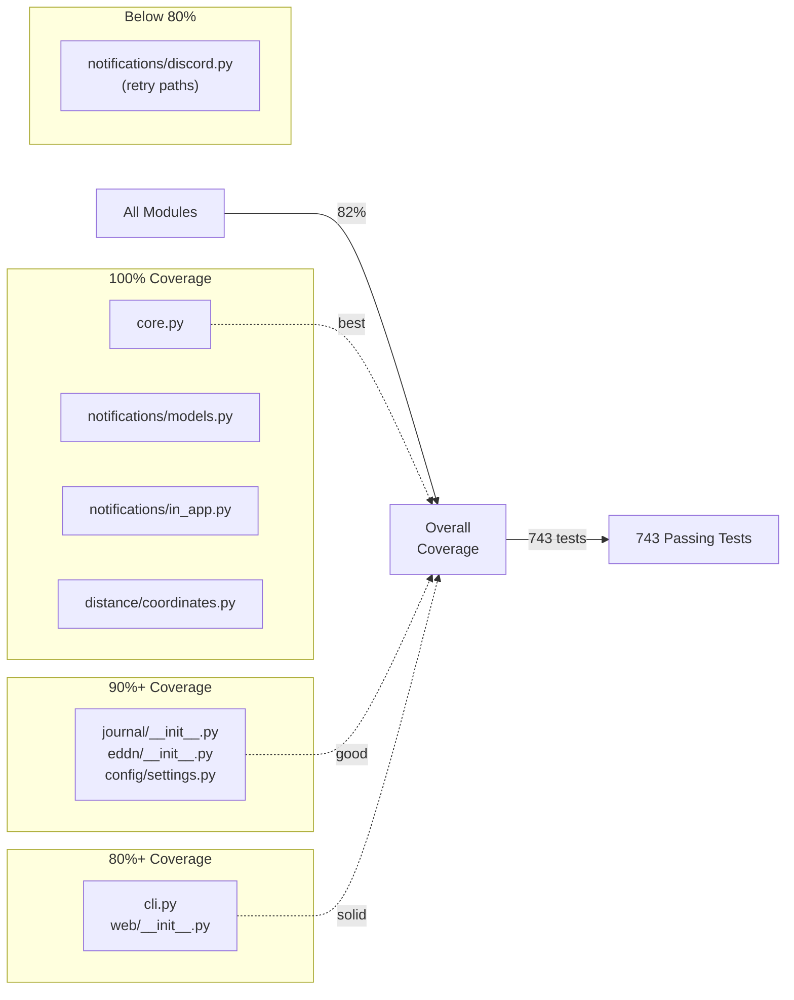

---

## Key Design Patterns

### Observer Pattern (Event-Driven)

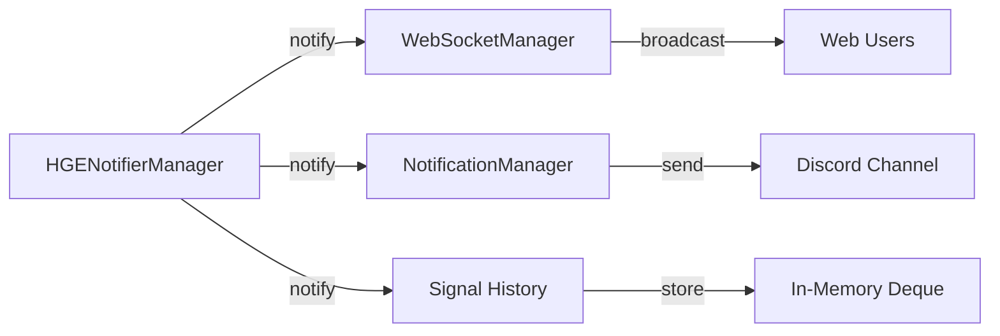

### Factory Pattern (Configuration)

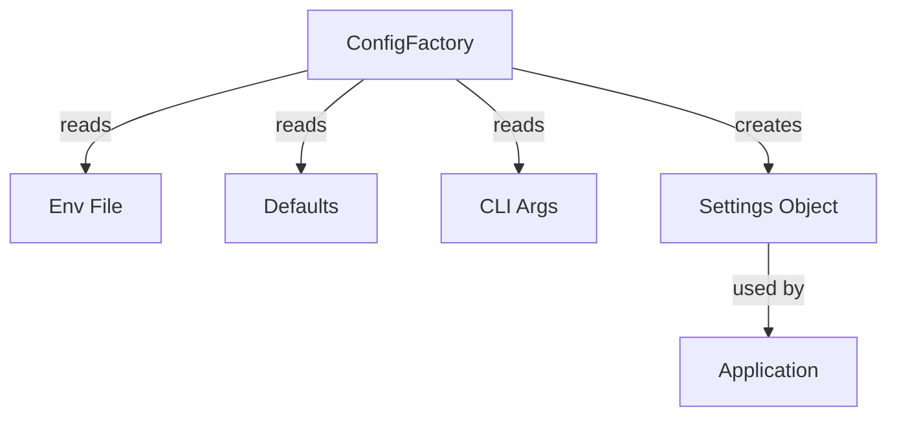

### Strategy Pattern (Notifications)

```mermaid
graph TB
    Manager["NotificationManager"]
    
    Strategy["Notification Strategy"]
    
    Discord["DiscordNotifier"]
    InApp["InAppNotifier"]
    
    Manager -->|uses| Strategy
    Strategy -->|implements| Discord
    Strategy -->|implements| InApp
```

---

## Performance Considerations

### Memory Management

```mermaid
graph TB
    App["Application"]
    
    subgraph "In-Memory Storage"
        History["Signal History<br/>maxlen=100"]
        SystemCache["System Info Cache<br/>TTL: 24 hours"]
        CoordCache["Coordinate Cache<br/>Persistent File"]
    end
    
    subgraph "Optimizations"
        Deque["Use deque for<br/>bounded history"]
        LRU["LRU caching for<br/>system info"]
        File["File-based caching<br/>for coordinates"]
    end
    
    App -->|stores| History
    App -->|stores| SystemCache
    App -->|stores| CoordCache
    
    History -->|implements| Deque
    SystemCache -->|implements| LRU
    CoordCache -->|implements| File
```

### Network Optimization

```mermaid
graph TB
    App["Application"]
    
    EDDN["EDDN Stream"]
    EDSM["EDSM API"]
    
    App -->|persistent connection| EDDN
    App -->|caches coordinates| CoordDB["Coordinate Database"]
    CoordDB -->|reduces API calls| EDSM
    
    Note["Caching reduces EDSM<br/>API calls by ~95%"]
```

---

## Error Handling & Recovery

### Error Handling Flow

```mermaid
graph TB
    Operation["Operation"]
    
    Try["Try Operation"]
    
    Success["Success"]
    
    Catch["Catch Exception"]
    
    Retry{"Should Retry?"}
    
    Log["Log Error"]
    
    Notify["Notify User"]
    
    Recover["Recover State"]
    
    Try -->|success| Success
    Try -->|exception| Catch
    
    Catch -->|evaluate| Retry
    Retry -->|yes| Try
    Retry -->|no| Log
    
    Log --> Notify
    Notify --> Recover
    Recover --> Continue["Continue Operation"]
```

### Connection Resilience

```mermaid
graph TB
    Connection["Connection to EDDN"]
    
    Connected["Connected"]
    Disconnected["Disconnected"]
    
    Connected -->|error| Disconnected
    Disconnected -->|retry| Try["Attempt Reconnect"]
    Try -->|success| Connected
    Try -->|failure| Backoff["Exponential Backoff"]
    Backoff -->|ready| Try
    
    Note1["Graceful degradation<br/>Works offline with mock data"]
```

---

## Security Considerations

### Security Architecture

```mermaid
graph TB
    subgraph "Data Protection"
        LocalOnly["Journal files<br/>stay local"]
        NoAuth["No authentication<br/>required"]
        NoPrivate["No personal data<br/>transmitted"]
    end
    
    subgraph "Network Safety"
        Discord["Discord webhook<br/>secure endpoint"]
        EDSM["EDSM API<br/>public read-only"]
        EDDN["EDDN stream<br/>anonymous data"]
    end
    
    subgraph "Code Quality"
        TypeHints["Type hints<br/>for safety"]
        Validation["Input validation"]
        ErrorHandle["Error handling"]
    end
    
    LocalOnly -->|ensures| Privacy["User Privacy"]
    Discord -->|ensures| Security["Network Security"]
    TypeHints -->|ensures| Quality["Code Quality"]
```

---

## Future Architecture Enhancements

### Proposed Phase 5 Features

```mermaid
graph TB
    Current["Current v0.1.0"]
    
    Phase5A["Phase 5A: Database"]
    Phase5B["Phase 5B: Advanced UI"]
    Phase5C["Phase 5C: Fleet Tracking"]
    
    subgraph "Database Features"
        SQLite["SQLite Backend"]
        Analytics["Historical Analytics"]
        Trending["Trend Analysis"]
    end
    
    subgraph "UI Features"
        Mapping["3D System Mapping"]
        Filtering["Advanced Filtering"]
        Export["Data Export"]
    end
    
    subgraph "Multiplayer Features"
        FleetTracking["Fleet Member Tracking"]
        MultiNotif["Multi-User Notifications"]
        SharedData["Shared Signal Data"]
    end
    
    Current -->|evolve to| Phase5A
    Current -->|evolve to| Phase5B
    Current -->|evolve to| Phase5C
    
    Phase5A -->|enables| SQLite
    Phase5A -->|enables| Analytics
    
    Phase5B -->|enables| Mapping
    Phase5B -->|enables| Filtering
    
    Phase5C -->|enables| FleetTracking
    Phase5C -->|enables| MultiNotif
```

---

## Glossary

| Term | Definition |
|------|-----------|
| **EDDN** | Elite Dangerous Data Network - crowdsourced real-time game data |
| **HGE** | High Grade Emission - specific type of USS signal in Elite Dangerous |
| **USS** | Unidentified Signal Source - points of interest in space |
| **EDSM** | Elite Dangerous Star Map API - provides system coordinates |
| **WebSocket** | Bidirectional real-time communication protocol |
| **Webhook** | HTTP callback mechanism for sending notifications |
| **ZMQ** | Zero Message Queue - efficient messaging framework |
| **Deque** | Double-ended queue data structure (used for history) |
| **LRU Cache** | Least Recently Used cache for memory optimization |

---

## Related Documentation

- [README.md](README.md) - Quick start and usage
- [DEVELOPMENT_NOTES.md](DEVELOPMENT_NOTES.md) - Development history and progress
- [ROADMAP.md](ROADMAP.md) - Future development plans
- [REAL_EDDN_USAGE.md](REAL_EDDN_USAGE.md) - Advanced usage with real EDDN

---

**Last Updated:** October 26, 2025  
**Status:** Production Ready v0.1.0  
**Coverage:** 82% | Tests: 743/743 passing ✅
